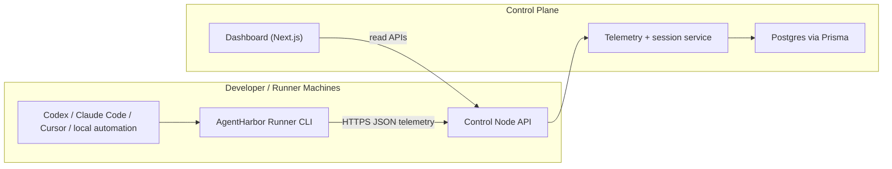

# AgentHarbor Architecture

## System diagram

## Component responsibilities

### Control node

- Owns runner enrollment and token issuance.
- Authenticates runner requests with bearer tokens hashed at rest.
- Accepts heartbeats and telemetry events.
- Maintains normalized runner/session/event state in Postgres.
- Exposes read APIs for dashboards and future integrations.

### Runner node

- Enrolls once and stores the issued token locally.
- Sends periodic heartbeats to keep runner liveness accurate.
- Emits structured telemetry instead of raw prompt content.
- Simulates activity in demo mode so the platform can be exercised without deep agent integrations.

### Dashboard

- Reads current fleet state from the control node.
- Shows online/offline runners, recent sessions, and recent event stream.
- Provides a session detail page that reconstructs session progress from structured telemetry.

## Data flow

1. A machine installs the runner and enrolls with `POST /v1/enroll`.
2. The control node creates `Machine`, `Runner`, and `RunnerToken` records, then returns the plaintext token once.
3. The runner sends `POST /v1/heartbeat` and `POST /v1/telemetry` over HTTPS with a bearer token.
4. The control node authenticates the token, updates runner liveness, and upserts `AgentSession` state from incoming session events.
5. Every telemetry event is persisted in `TelemetryEvent`.
6. The dashboard reads `/v1/runners`, `/v1/sessions`, `/v1/events`, and `/v1/stats` to render the operator console.

## Database model

### Runner

- Identity for a runner installation.
- Tracks liveness (`status`, `lastSeenAt`) and machine association.

### Machine

- Canonical machine descriptor (`hostname`, `os`, `architecture`).
- Shared across runners if the fingerprint matches.

### RunnerToken

- Stores only hashed bearer tokens.
- Supports future token rotation and revocation.

### AgentSession

- Durable session summary keyed by `sessionKey`.
- Updated as `started`, `summary.updated`, `completed`, and `failed` events arrive.

### TelemetryEvent

- Append-only structured event log.
- Linked to a runner and optionally to a session.

## Transport boundary

The SDK depends on an explicit `ControlPlaneTransport` interface and ships an `HttpControlPlaneTransport` implementation. That keeps the data contracts stable while allowing a future gRPC streaming transport to replace the V1 HTTP transport without rewriting every runner integration.
