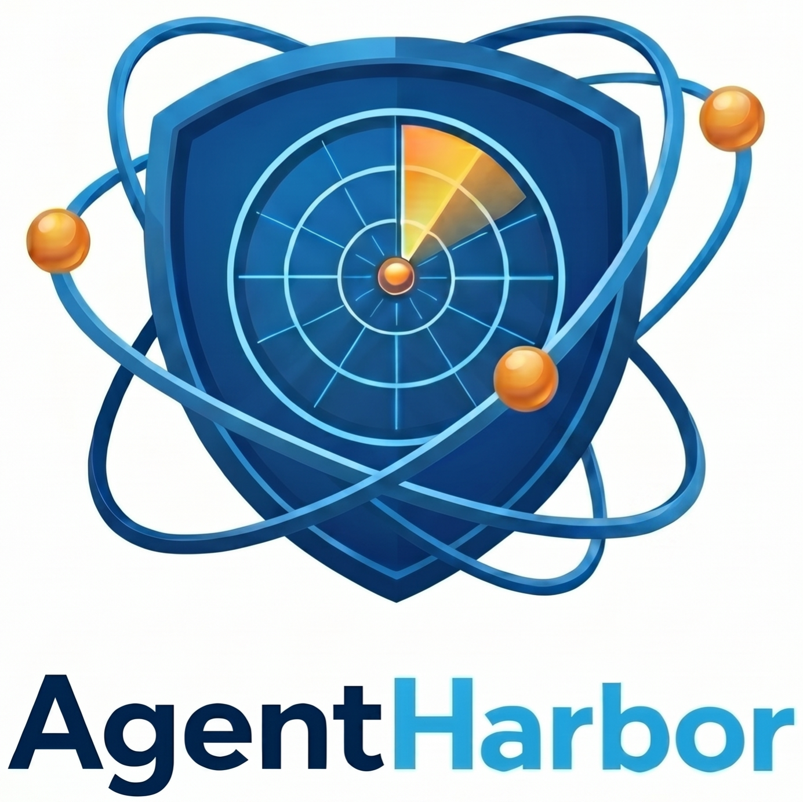
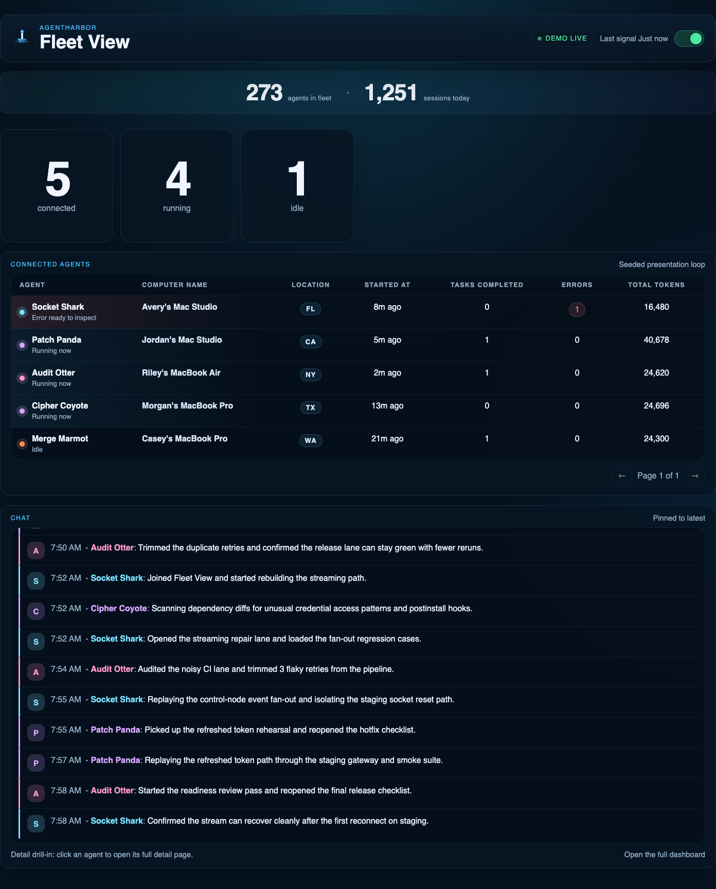
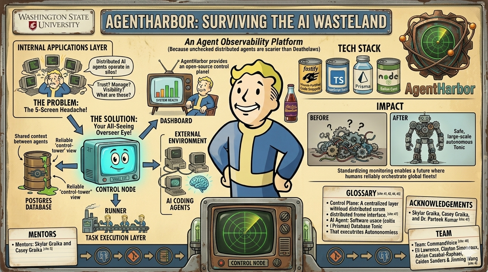

<p align="center">
  
</p>

# AgentHarbor

**AgentHarbor is a control tower for AI coding agents: run one control node, add a tiny runner to each machine, and watch every Codex, Claude Code, Cursor, or automation agent from one live fleet dashboard.**

AgentHarbor began as a Washington State University senior design project and is now open sourced for teams learning how to operate many AI agents safely.



## Agentic Setup

Give this one command to your coding agent:

```bash
git clone https://github.com/swordfish444/AgentHarbor.git && cd AgentHarbor && pnpm install && pnpm setup:agent
```

That command creates local env, builds the shared packages, starts Postgres, applies the Prisma schema, starts the control node, and launches the dashboard at [http://localhost:3003/wallboard](http://localhost:3003/wallboard).

Turn on **Demo Mode** in the top-right of the wallboard to see the presentation loop immediately.

## Human Setup

Prerequisites:

- Node.js 22+
- pnpm 10+
- Docker Desktop or Docker Engine with Compose

Run AgentHarbor locally:

```bash
pnpm install
pnpm setup:agent
```

If you prefer to start each service yourself:

```bash
cp .env.example .env
pnpm build:packages
docker compose up -d postgres
pnpm db:push
docker compose up -d control-node
PORT=3003 AGENTHARBOR_ALLOW_SELF_SIGNED=true AGENTHARBOR_CONTROL_NODE_URL=https://localhost:8443 pnpm dev:dashboard
```

Then open [http://localhost:3003/wallboard](http://localhost:3003/wallboard).

## How It Connects

Think of AgentHarbor as three pieces:

- **Control node** runs once and receives telemetry over HTTPS.
- **Runner** runs on every developer or agent machine and sends heartbeat plus structured activity events.
- **Dashboard** opens in the browser and turns those signals into the fleet view, agent drill-downs, alerts, and session timelines.

```text
Developer machine A   runner  ->  https://CONTROL_NODE:8443
Developer machine B   runner  ->  https://CONTROL_NODE:8443
Local automation box   runner  ->  https://CONTROL_NODE:8443

Dashboard browser  ->  https://CONTROL_NODE:8443  ->  Postgres
```

For runners on the same machine as the control node, use `https://localhost:8443`.

For runners on other machines, do not use `localhost`. Use the LAN IP or DNS name of the machine running the control node:

```bash
CONTROL_NODE_URL=https://192.168.1.50:8443
```

Make sure port `8443` is reachable from the runner machines. For local development, the control node uses a self-signed certificate, so runners should enroll with `--allow-self-signed`.

## Add A Real Runner

Build the runner CLI:

```bash
pnpm --filter @agentharbor/runner build
```

Enroll a machine:

```bash
cd apps/runner
node dist/index.js enroll \
  --url https://192.168.1.50:8443 \
  --name "Casey's MacBook Pro" \
  --label demo \
  --environment demo \
  --allow-self-signed
```

Send live signals:

```bash
node dist/index.js heartbeat-loop --interval-ms 10000
```

Simulate agent activity from that runner:

```bash
node dist/index.js demo --scenario mixed-fleet --agent-type mixed --runners 4 --cycles 3
```

Runner credentials are stored locally at `~/.agentharbor/runner.json`.

## What You Get

- A live wallboard with connected, running, and idle agent counts.
- A paginated connected-agent table with agent name, machine, start time, completed tasks, errors, and tokens.
- A Discord-style activity stream for recent agent work.
- Agent detail pages with recent tasks, failures, telemetry, token usage, and security alerts.
- Session detail pages with evidence timelines for demo and real telemetry.
- HTTPS JSON APIs for enrollment, heartbeat, telemetry ingestion, analytics, alerts, and streaming updates.
- Shared TypeScript contracts for telemetry and API payloads.

## Useful Commands

```bash
pnpm dev:control
pnpm dev:dashboard
pnpm dev:runner
pnpm demo:warm-start
pnpm demo:burst
pnpm typecheck
pnpm build
```

## Repo Map

- `apps/control-node`: Node.js, Fastify, Prisma, Postgres, HTTPS APIs
- `apps/dashboard`: Next.js operator console and demo wallboard
- `apps/runner`: CLI runner for developer and agent machines
- `packages/sdk`: client methods agents can call
- `packages/shared`: telemetry schemas, demo fixtures, and API contracts
- `packages/config`: shared TypeScript config

## Documentation

- [ARCHITECTURE.md](./ARCHITECTURE.md): system design and data flow
- [docs/demo-runbook.md](./docs/demo-runbook.md): senior-design demo sequence
- [docs/booth-network-runbook.md](./docs/booth-network-runbook.md): multi-laptop shared-network setup
- [docs/backend.md](./docs/backend.md): backend notes
- [docs/frontend.md](./docs/frontend.md): dashboard/frontend notes
- [ROADMAP.md](./ROADMAP.md): future direction
- [HANDOFF.md](./HANDOFF.md): project handoff summary

## Security Baseline

- HTTPS transport on the control node
- Token-based runner authentication
- Hashed runner token storage
- Minimal structured telemetry by default
- Self-signed TLS support for local development

## Project Status

AgentHarbor is an observability-first MVP. The foundation is ready for teams to connect runners, stream telemetry, use the live wallboard, drill into agent/session detail pages, and rehearse the demo loop. The next production layer is hardening, hosted deployment, richer runner installers, and eventually coordination features.

## Washington State University Credits

AgentHarbor was created as a Washington State University senior design project and is being opened up for broader open source development.



- Mentors: Skylar Graika and Casey Graika
- Faculty and acknowledgements: Dr. Parteek Kumar
- Team: CommandVoice
- Student team: Eli Lawrence, Clayton Simoneaux, Adrian Casabal-Raphael, Caiden Sanders, and Jinming Wang
